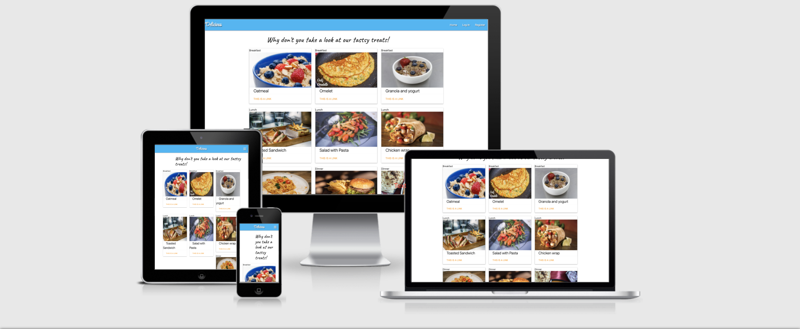

# Delicious- A Recipe App
## Python & Flask - Data Centric Development - Milestone Project 3

  
The image is from [Am I responsive?](http://ami.responsivedesign.is/)

[live site here](https://mls3.herokuapp.com/)

Delicious is a recipe app built on the Flask framework using MongoDB database. The purpose of this project is to "Create a web application that allows users to store and easily access cooking recipes", using the CRUD operations of Create, Read, Update, and Delete for their recipes.

The deployed site can be found [here](#).

# Table of Contents
## UX

## Table of Contents

1. **[UX](#UX)**

   * **[User Stories](#user-stories)**
   * **[Design](#design)**
     * **[Framework](#framework)**
     * **[Database](#database)**
     * **[Color Scheme](#color-scheme)**
     * **[Typography](#typography)**
     * **[Icon](#icon)**
   * **[Wireframes](#wireframes)**

2. **[Features](#features)**
   * **[Existing Features](#existing-features)**
   * **[Features Left to Implement](#features-left-to-implement)**

3. **[Technologies Used](#technologies-Used)**
   * **[Languages](#languages)**
   * **[Libraries](#libraries)**
   * **[Tools](#tools)**
   * **[Hosting](#hosting)**

4. **[Testing](#testing)**

5. **[Deployment](#deployment)**

6. **[Credits](#credits)**
    * **[Content](#content)**
    * **[Media](#media)**
    * **[Acknowledgements](#acknoledgements)**
    * **[Disclaimer](disclaimer)**

## UX

I have a huge interest in cooking and baking so I was delighted when I got the chance to make a website with some of my favourite dishes.
This website has been designed as a multi-page front end website with login possibility.

### User Stories

As a user, I want to be able to:

* View the recipes from any device (mobile, tablet, desktop).
* See recipes from other users to get new ideas.
* Easily navigate through the recipes.
* Search recipes by different category.
* Login and add my recipes.[Creatre]
* Get the instruction to make a dish from this site.[Read]
* Edit the recipes I've added.[Edit]
* Delete the recipes I've submitted.[Delete]

### Design

#### Framework

* **[Materialize 1.0.0](https://materializecss.com/)**

I used materialize for my css layout
  
* **[jQuery 3.5.1](https://code.jquery.com/jquery/)**

  Used to manipulate the DOM, for example buttons, and showing / hiding elements

* **[Flask 1.0.2](https://palletsprojects.com/p/flask/)** 

  Flask is the framework that runs the application

#### Database

I used MongoDB for my database it was good to get experience using NoSQL database MongoDB.

The database is made up of the following collections

**tasks**

      id: <ObjectId>
      category_name: <string>
      task_name: <string>
      task_ingredients: <Array>
      image_url:<string>
      task_prep: <Array>
      task_difficulty: <String>
      task_time: <String>

**users**

      id: <ObjectId()>
      
       username: <string>
      
      password: <string>

**categories**
    
    id: <ObjectID()>
    
    category_name: <String>

#### Typography

I used the following fonts i got from [Google fonts](https://fonts.google.com/)

* **Cursive** was used for all heading elements.

#### Icon

[Font Awesome](https://fontawesome.com/v4.7/get-started/) was used for all the icons in this project.

### Wireframes

I used [Whimsical](https://whimsical.com/wireframes) for the planning process for this project.

You can go [here](https://whimsical.com/the-beginning-ABP7BxZPnN9v2GrPq76YwE) to see my wireframes!

### Features

#### Existing Features

* **Navigation bar**
   
    The navigation bar features the Delicious brand name in the top left corner.

    * For visitors to the site who are not logged in, list items links are available for them to use.
    
      a. Home

      b. Log In
      
      c. Register
      
   * For users who are logged in, the list items are as follows:
     
      a. Home
      
      b. Profile
      
      c. Add Recipes
    
      d. Logout

   * The navbar is collapsed into a burger icon on small and medium screens. The options remain the same, but they are instead accessed using a side navigation element which can be accessed through 'burger' icon at the top right. 
   
* **Footer**

   The footer has copyright information and social media links.

* **Register User**

   Users can use the site as a guest, but some features are not available unless logged in.I have built-in authentication and authorization to check certain criteria is met before an account is validated. All passwords are hashed for security purposes!
  
   When a user registers,they are automatically logged in and redirected to the home page.

* **Log In to Account**
  
   The login page has an input form like register form where the users will enter their username and password.
    
   Flash message If the username is not registered or if the password is incorrect an error message will appear

   Saying "Incorrect Username and/or Password".   

   New users can click on the link "Register here" to get redirected to the register page.

* **Log Out of Account**
 
   Users can easily log out of their account with the click of a button.

* **View All Recipes**

   On the Home page, all recipes are  displayed, with a standard 3-items per row.

* **Add a Recipe**

  [**C**RUD] **C**reate or 'add' a new recipe.
  
  Logged in users can add their recipes. For selective fields,user can select the options from drop down. All the fields of the form is well explained with the 'placeholder' to make it easy for the user.

* **View Recipe**

  [C**R**UD] **R**ead or 'review' recipes, either from the home page, or the user recipes page. 
  
  If the user viewing is the user who submitted, they will have additional options edit and delete. 
  Delete button allow the user to completely remove the recipe from the database.

* **Update Recipe**

  [CR**U**D] **U**pdate or 'edit' their own user recipes on this page.
  
  The edit recipe form is identical in layout to the add recipe form, and very similar in functionality.
  User can either save or cancel the changes by clicking the appropriate buttons.
  
* **Delete Recipe**

  [CRU**D**] **D**elete or 'remove' a user's own recipes.
  
  If the user clicks the delete button, a popup modal will appear asking for confirmation. If the user still choose to delete, the recipe will be permanently deleted.

#### Features Left to Implement

* Search: Search button with more filters.
* Liking/Dislike buttons: Users and pick which recipe thel like and dislike most.

### Technologies Used

#### Languages

*   **[HTML](https://html.spec.whatwg.org/multipage/)** used as the markup language
  
*   **[CSS](https://www.w3.org/Style/CSS/)** used as the base for cascading styles.

*   **[JavaScript](https://developer.mozilla.org/en-US/docs/Web/JavaScript)** used mostly for DOM manipulation

*   **[Python3](https://www.python.org/)** used to run the backend application

#### Libraries

* **[Google Fonts](https://fonts.google.com/)** provided the fonts used throughout the project

* **[Font Awesome](https://fontawesome.com/)** v5.8.2 to provide the icon set

* **[Materialize](https://materializecss.com/)** v1.0.0 used as the CSS framework for the project

* **[jQuery](https://jquery.com/)** used as the primary JavaScript functionality.

* **[Flask](https://flask.palletsprojects.com/en/1.1.x/)** v1.0.2 is the micro web framework that runs the application

* **[Jinja](https://jinja.palletsprojects.com/en/2.10.x/)** v2.10.1 is the default templating language for flask and is used to display data from the python application in the frontend html pages

* **[PyMongo](https://flask-pymongo.readthedocs.io/en/latest/)** 2.3.0 was used to enable the python application to access the Mongo database

#### Tools

* **[Heroku](https://www.heroku.com)** Was used for deploying the project.

* **[MongoDB Atlas](https://www.mongodb.com/cloud/atlas)** is used to store my database in the 'cloud'.

* **[GitHub](https://github.com/)** provides hosting for software development version control using Git

* **[Whimsical](https://whimsical.com/wireframes)** was used to create the wireframes when initially planning this project

* **[Am I Responsive](http://ami.responsivedesign.is/)** to create the images in this readme file.

##### Hosting

  **[Heroku](https://www.heroku.com)** is used to host the app
  
### Testing

Most of the testing was manual testing during the development of the site with additional testing completed at the end, before this write up.

Friends and family have also tested by creating accounts and using the site on their own devices. They have tested how the page displays, registered their own accounts, added their recipes, edited and deleted.

To test the site yourself, you can

Browse as a guest, but with limited functionality.

Create your own user. Do not use a password you use elsewhere as the passwords are not secure.

Use an existing user to see how the app handles user recipes 

You can do this with:

Username: eoooin
Password: milestone

If testing with user 'eoooin', please don't deleting any recipes. To test this aspect of the site, you can create and delete submissions with users you create yourself.

#### Validation Services

The following validation services were used to check the validity of the website code.

* [W3C Markup Validation](https://validator.w3.org/) was used to validate **HTML**.

  Unfortunately the W3C Validator for HTML does not understand the Jinja templating syntax, so it therefore shows a lot of errors with regards to {{ variables }},  , etc. Aside from the Jinja warnings and errors, all of the remaining code is perfectly validating. Also due to the Jinja templating, certain elements cannot be 'beautified' across multiple lines, and must remain on a single line.
  
* [W3C CSS validation](https://jigsaw.w3.org/css-validator/) was used to validate **CSS** and there were no errors.

*  [PEP8 Online](http://pep8online.com/) was used to validate Python.

* [jshint](https://jshint.com/) was used to validate the Javascript and showed no errors.

#### Problems and bugs

* While I was implanting the edit and delete button I was trying to add in this piece of code 
**** which would display the buttons to logged in users. After having multiple sessions with tutors and a lot of googling I was unable to add it successfully.

        

#### Responsiveness 

The site has been tested successfully on 
  
   * Apple Macbook pro 
   * Apple iPhone X
   * Desktop - Chrome v.74
   * Desktop - Firefox v.67

#### Features Testing
 
 * **Creating an Account**
 
 I've created my own account, and everything seems to be in working condition

* Log In To An Existing Account
 
  The accounts created as part of the previous test were used to test the log in functionality and I was able to log in with each of them.

* Log Out

  All accounts could also be successfully logged out. Print statements were used in the python console to confirm the username variable had been removed from the session.

### Deployment

#### Deployment To Heroku

In order the deploy my project to Heroku I have completed the following steps:

 **AWS Cloud9 IDE**
 
* Created a Procfile with the command echo web: python run.py > Procfile.
* Created a requirement.txt file so Heroku know what python modules it will need to run my application with the command sudo pip freeze --local > requirements.txt
* Then git add and git commit the new prerequisites from the requirements.txt file and Procfile, then 'git push' the undertaking to GitHub.
* Created config Vars such as my Secret Key, IP PORT and MONGO_URI within .bashrc so I could still run the project from my own IDE
 

 **Heroku**

* After loging into heroku I created a new app, using the name mls3 and set the region to Europe.

* Select application

* In the settings tab I clicked reveal config vars and entered the required environment variables, which in this case were:

    IP 0.0.0.0

    PORT 5000

    MONGO_URI mongodb+srv://root:<password_removed>@myfirstcluster-fai9p.mongodb.net/cook_book?retryWrites=true&w=majority

    SECRET secret key for flask session
    
* From the heroku dashboard of your newly created application, click on "Deploy" > "Deployment method" and select GitHub.

* Confirm the linking of the heroku app to the correct GitHub repository.

* In the heroku dashboard, click "Deploy".

* In the "Manual Deployment" section of this page, made sure the master branch is selected and then click "Deploy Branch".

* The site is now successfully deployed.

#### Local Deployment

Should you wish the run a local copy of this application of your local machine, you will need to follow the instructions listed below:

Tools you may need:

Python 3 installed on your machine [https://www.python.org/downloads/](https://www.python.org/downloads/)

PIP installed on your machine [https://pip.pypa.io/en/stable/installing/](https://pip.pypa.io/en/stable/installing/)

Git installed on your machine [https://gist.github.com/derhuerst/1b15ff4652a867391f03](https://gist.github.com/derhuerst/1b15ff4652a867391f03)

Flask installed on your machine [https://pypi.org/project/Flask/](https://pypi.org/project/Flask/)

Pymongo installed on your machine [https://pypi.org/project/pymongo/](https://pypi.org/project/pymongo/)

DnsPython installed on your machine [https://pypi.org/project/dnspython/](https://pypi.org/project/dnspython/)

### Credits

#### Content

  The recipes for the cookbook were sourced from [bbcgoodfood.com](https://www.bbcgoodfood.com/).
  

#### Media

  The images for the recipes have been sourced from their respective recipes at [pexels.com](https://www.pexels.com/).
  
  The images for the logo image,Category images on the home page were taken from google free images.
  
####  Acknowledgements

  **Tutorials**
  
  https://stackoverflow.com

  https://www.youtube.com/watch?v=vVx1737auSE - 
  
  
Special thanks to Guido Cecilio Garcia, my Code Institute mentor, and the tutors at code institute for helping me.

